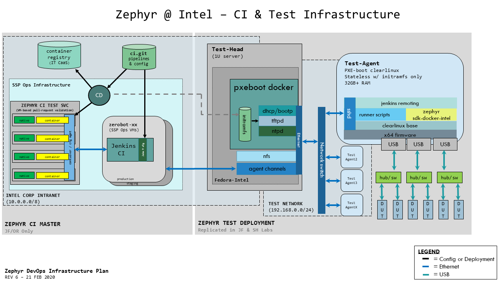

This is the production repo to contain Zephyr DevOPS CI integrations, configs, and other info. 

# Zephyr @ Intel CI Documentation 

# CI Terminology
* **Jenkins** - A popular open-source CI/CD tool. Zephyr DevOps operates several Jenkins master instances at zerobot2, zerobot-stg & zephyr-ci.
* **Agent** - Jenkins terminology for a remote computer used for building, testing in a CI/CD pipeline. Any computer capable of executing commands over ssh can be a Jenkins agent.
* **Test-agent** - Jenkins agent that's configured for device-testing
* **Build-agent** - Jenkins agent that's intended for virtual (qemu-only) sanitycheck jobs, not device-testing
* **Test-head** - A dedicated server that provides services for a set of agents, via test-network.
* **Test-net** - Private network linking a Testhead with a set of agents, implemented as a star-topology around a Gigabit Ethernet switch
* **PXE Boot** - Also known as "network boot", this service allows a computer to receive it's operating system via a network link, removing the requirement for a hard-disk
* **PXE Boot Docker (pxeboot.docker)** - Zephyr DevOps-created tool that provides PXE boot services & automates generation of PXE boot initramfs payload
* **Workspace** - A build directory created by Jenkins for a specific job. Test-agents can have multiple workspaces, one for each job.

# Architecture

		
## Frequently Asked Questions
### What services does the Test-head provide
* PXE boot server for all downstream test-agents connected to the Test-net
* dnsmasq providing DHCP/BOOTP + tftp services
* grub bootloader
* clearlinux kernel, straight from latest mainline clr repos
* clearlinux initramfs, pulled from latest clr but modified by pxeboot.docker/initrd.gen
* ansible playbooks for managing agent inventory, used for post-boot configuration & testing
		
### Do the agents have internet or Intel intranet access?
Not normally. This limitation is intentional- agents should only receive work sent by the Jenkins master & we don't want jobs to pull data from external sources. 

If a job on an agent requires external network resources, a step should be added on the Jenkins master in the context creation phase. We do support back-tunneled proxy connections via ssh, allowing arbitrary packages to be installed from an ansible playbook during configuration-mgmt operations.
	
### How does Jenkins communicate & authenticate with the test-agents?
All Jenkins-Agent communication occurs via Jenkins Remoting, over ssh. Authentication is via a single SSH key that is generated by the pxeboot service when it is installed on the Testhead.

### If the agents are confined to the private test net, how does Jenkins connect to the agents?
The Testhead implements an ssh port-forward through the test firewall, one port for each agent. For example:
	external port 22220 -> private 192.168.0.220:22
	external port 22221 -> private 192.168.0.221:22
	...

### Can I login to the agents directly?
Yes, this is an expected tasks for DevOps & QA engineers for debugging. You will need the SSH key for root@<test-agent> from the test-head, located at <TODO: decide std path>. To login:
    ssh -i <path-to-key> root@<test-agent.ip.address>

### Where are my build files on the test-agent?
Jenkins remoting uses a $JENKINS_HOME/$WORKSPACE/$JOB_NAME convention for all jobs on the test-agents. Currently $JENKINS_HOME is /jenkins for all Zephyr DevOps test & build agents

### How often do the test-agents power-on or reboot?
It depends- the test-agents are designed to be powered-off when they're not used & powered-on before a job so that DUTs are tested in a freshly power-on state. 

Note: As of WW08'2020, we do not force agents to power-down after a job so that job state is maintained for debugging purposes.

### How do agents register with the Jenkins master
Currently, we do this manually, entering the port #, agent name & labels manually. This operation is only required when a new agent is added or it's DUT inventory is changed.

DevOps is developing an automated process that uses an ansible inventory file to specify the agent-to-DUT mapping using a simple array of DUT types, ETA Z03'2020.

### How is DUTs inventory mapped to agents?
We use Jenkins agent labels to indicate which DUTs are connected to a specific test-agent. Jenkins allows mulitiple labels per agent, for example:
    nuc_64gb-jf			# label for a generic NUC in jf (Jones Farm) with 64GB of RAM suitable for virtual sanitycheck jobgs
    hwtest-jf-frdm_k64f # label for a hwtest agent in JF with a frdm_k64f zephyr DUT attached.

Each test-agent is listed by IP address in an ansible inventory file that also specifies an array of Zephyr-project DUTs that are attached. When the ansible playbook is run at agent boot, this array is read and automatically.
