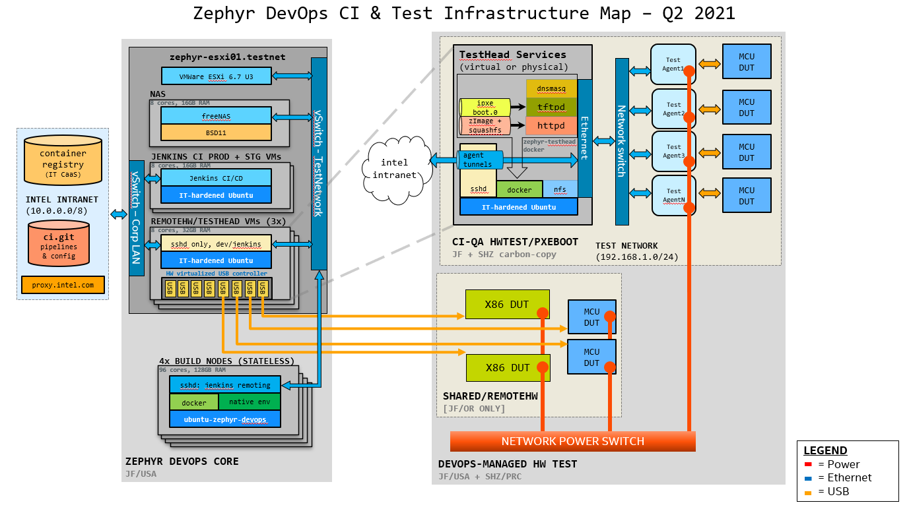

# Intel 1RTOS / Zephyr internal CI repo
*a catch-all repo for DevOps services & documentation*

**Contact: email to: FMOS_DevOps, cc: Vondrachek, Chris & Graydon, Connor**

## hidden.tar.secret & accessing the hidden/ directory
DevOps infrastructure secrets & private configuration data is stored in hidden.tar.secret, a git-secret encrypted tar archive with access controlled by a GPG keyring. 

### To reveal contents of hidden.tar.secret into ./hidden/ :
1. Your public GPG key must be enrolled in the git-secret keyring - email FMOS DevOps PDL for more info. 
2. Use our automation script to decrypt hidden.tar.secret & decompress to hidden/

	````trusted-gpg-user@ci.git/ $ ./reveal-hidden.sh````

3. Access protected files at hidden/
4. If any changes are made, you MUST run ````./hide-hidden.sh```` to capture changes & re-encrypt the ./hidden directory

### To hide the contents of hidden/ & stage hidden.tar.secret for commit:
1. Your public GPG key must be enrolled in the keyring in this repo. 
2. Use our automation script to tar & encrypt ./hidden/, and also stage the change for commit:

	````trusted-gpg-user@ci.git/ $ ./hide-hidden.sh````

3. Commit changes to hidden.tar.secret & push per usual

## Useful Links
### [ci.git/docs](docs/) - more DevOps documentation
### [Zephyr DevOps Overview.pptx](https://intel-my.sharepoint.com/:p:/p/christopher_g_turner/EfZ2TF9ElydPjpGBEAKiUkwBiFt5LFBZPI2aGO_HZnP7Wg?e=Bxeeho) - Permalink for our most-often presented slide-deck

# Block Diagram


