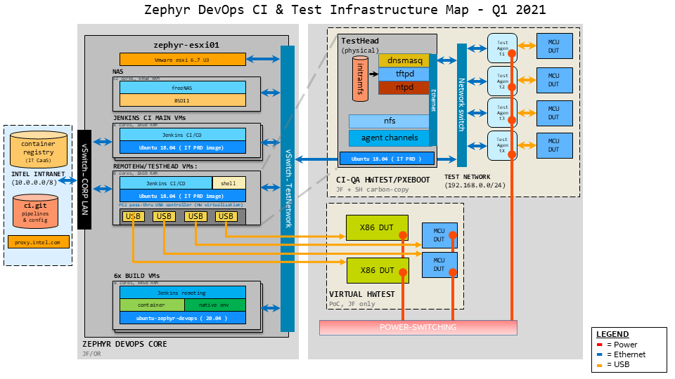

# Intel internal Zephyr CI
## *operated by your friendly IAGS/FMOS Zephyr DevOps team*
### mail PDL: FMOS_DevOps 

## [DevOps Documentation Wiki](https://gitlab.devtools.intel.com/zephyrproject-rtos/ci/-/wikis/home)
## [Zephyr DevOps Overview](https://intel-my.sharepoint.com/:p:/p/christopher_g_turner/EfZ2TF9ElydPjpGBEAKiUkwBiFt5LFBZPI2aGO_HZnP7Wg?e=Bxeeho)

# CI Terminology
* **Jenkins** - A popular open-source CI/CD tool. Zephyr DevOps operates several Jenkins master instances at zerobot2, zerobot-stg & zephyr-ci.
* **Agent** - Jenkins terminology for a remote computer used for building, testing in a CI/CD pipeline. Any computer capable of executing commands over ssh can be a Jenkins agent.
* **Test-agent** - Jenkins agent that's configured for device-testing
* **Build-agent** - Jenkins agent that's intended for virtual (qemu-only) sanitycheck jobs, not device-testing
* **Test-head** - A dedicated server that provides services for a set of agents, via test-network.
* **Test-net** - Private network linking a Testhead with a set of agents, implemented as a star-topology around a Gigabit Ethernet switch
* **PXE Boot** - Also known as "network boot", this service allows a computer to receive it's operating system via a network link, removing the requirement for a hard-disk
* **PXE Boot Docker (pxeboot.docker)** - Zephyr DevOps-created tool that provides PXE boot services & automates generation of PXE boot initramfs payload
* **Workspace** - A build directory created by Jenkins for a specific job. Test-agents can have multiple workspaces, one for each job.

# Architecture

